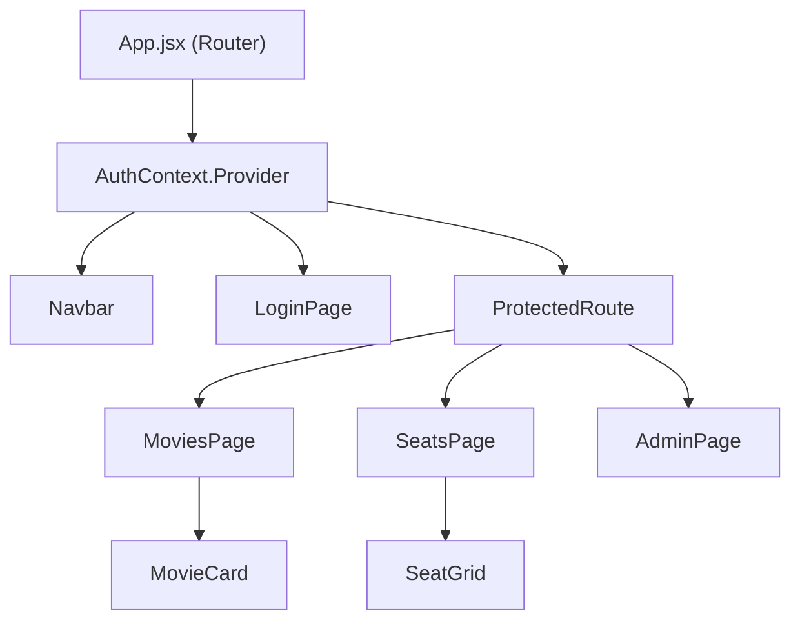
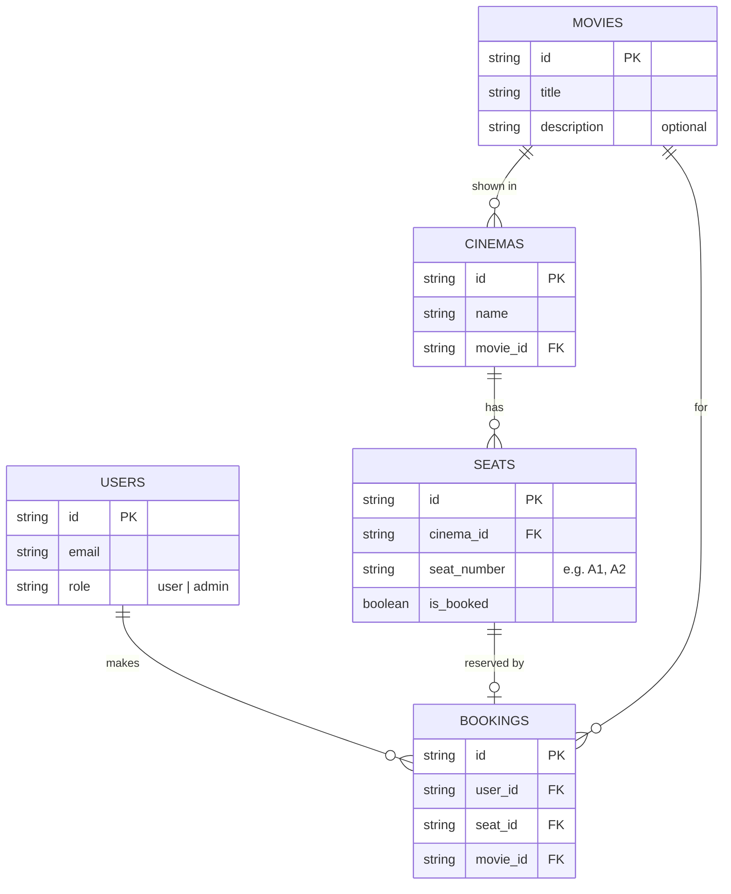

# Cinema Booking System — Architecture

## High-Level Overview

A client-side React web application backed entirely by Firebase services (Authentication + Firestore). There is **no custom backend server** — all business logic runs in the browser, and Firebase handles auth, data persistence, and real-time sync.

```
┌─────────────────────────────────────────────────┐
│                    Browser                      │
│  ┌───────────────────────────────────────────┐  │
│  │           React Application               │  │
│  │  ┌─────────┐ ┌──────────┐ ┌───────────┐  │  │
│  │  │  Pages  │ │Components│ │  Contexts  │  │  │
│  │  └────┬────┘ └────┬─────┘ └─────┬─────┘  │  │
│  │       └───────────┼─────────────┘         │  │
│  │                   ▼                       │  │
│  │          Firebase SDK (client)            │  │
│  └───────────────────┬───────────────────────┘  │
└──────────────────────┼──────────────────────────┘
                       │ HTTPS
                       ▼
          ┌────────────────────────┐
          │    Firebase Cloud      │
          │  ┌──────────────────┐  │
          │  │  Authentication  │  │
          │  │  (Google Sign-In)│  │
          │  └──────────────────┘  │
          │  ┌──────────────────┐  │
          │  │    Firestore     │  │
          │  │   (Database)     │  │
          │  └──────────────────┘  │
          └────────────────────────┘
```

---

## Project Structure

```
src/
├── components/          # Reusable UI components
│   ├── SeatGrid.jsx         # Cinema seat layout grid
│   ├── MovieCard.jsx        # Single movie display card
│   ├── Navbar.jsx           # Navigation bar with auth state
│   └── ProtectedRoute.jsx   # Route guard for authenticated users
│
├── pages/               # Top-level route pages
│   ├── LoginPage.jsx        # Google sign-in screen
│   ├── MoviesPage.jsx       # Browse available movies
│   ├── SeatsPage.jsx        # View & book seats for a movie
│   └── AdminPage.jsx        # Admin CRUD for movies & cinemas
│
├── contexts/            # React Context providers
│   └── AuthContext.jsx      # Provides current user + role info
│
├── services/            # Firebase interaction layer
│   ├── firebase.js          # Firebase app init & exports
│   ├── authService.js       # Sign-in / sign-out helpers
│   ├── movieService.js      # Firestore CRUD for movies
│   ├── cinemaService.js     # Firestore CRUD for cinemas
│   ├── seatService.js       # Seat queries & booking logic
│   └── bookingService.js    # Create / read bookings
│
├── App.jsx              # Root component + routing
└── index.js             # Entry point
```

---

## Component Architecture



### Key Components

| Component | Responsibility |
|---|---|
| `AuthContext` | Wraps the app; exposes `user`, `role`, `login()`, `logout()` via `useContext` |
| `ProtectedRoute` | Redirects unauthenticated users to `LoginPage` |
| `MoviesPage` | Fetches movies from Firestore, renders a list of `MovieCard` components |
| `SeatsPage` | Receives `movieId` via route param, loads cinemas/seats, renders `SeatGrid` |
| `SeatGrid` | Displays seats in a grid; handles click-to-book with availability validation |
| `AdminPage` | Visible only to admin-role users; provides forms to add/edit/delete movies & cinemas |

---

## State Management

**Only `useState` and `useContext`** are used (no Redux or external state libraries).

| State | Location | Description |
|---|---|---|
| Auth user & role | `AuthContext` | Globally available via `useContext(AuthContext)` |
| Movie list | `MoviesPage` (local) | Fetched on mount with `useState` + `useEffect` |
| Seat statuses | `SeatsPage` (local) | Fetched per selected cinema, updated after booking |
| Admin form data | `AdminPage` (local) | Controlled inputs for CRUD operations |

---

## Data Model (Firestore Collections)



---

## Core User Flows

### 1. Authentication

```
User opens app
  → AuthContext checks Firebase auth state
    → Not signed in → LoginPage → click "Login with Google"
      → Firebase Google popup → success → AuthContext updates user
        → Redirect to MoviesPage
    → Already signed in → MoviesPage
```

### 2. Booking a Seat

```
MoviesPage (select movie)
  → Navigate to SeatsPage with movieId
    → Fetch cinema(s) for movieId
    → Fetch seats for cinema
    → Render SeatGrid (available / occupied)
      → User clicks available seat
        → seatService checks is_booked === false
          → If available → update seat to is_booked: true
                         → create booking document
                         → refresh grid
          → If occupied  → show error message
```

### 3. Admin CRUD

```
AdminPage (admin-role only)
  → View list of movies & cinemas
  → Add: fill form → write document to Firestore
  → Edit: select item → update document
  → Delete: select item → delete document + cascade-clean related seats/bookings
```

---

## Authentication & Authorization

| Concern | Approach |
|---|---|
| Sign-in method | Firebase Auth — Google provider only |
| Session management | Firebase SDK handles tokens automatically |
| Role detection | On sign-in, look up user doc in `users` collection; match by email |
| Admin identification | Predefined admin email(s) stored in Firestore or app config |
| Route protection | `ProtectedRoute` component checks auth state; `AdminPage` additionally checks `role === "admin"` |

---

## Service Layer

Each service module in `src/services/` encapsulates Firestore operations for one collection. This keeps components thin and makes it easy to swap or mock data access.

| Service | Key Functions |
|---|---|
| `authService` | `signInWithGoogle()`, `signOut()`, `onAuthChange(callback)` |
| `movieService` | `getMovies()`, `addMovie(data)`, `updateMovie(id, data)`, `deleteMovie(id)` |
| `cinemaService` | `getCinemasByMovie(movieId)`, `addCinema(data)`, `updateCinema(id, data)`, `deleteCinema(id)` |
| `seatService` | `getSeatsByCinema(cinemaId)`, `bookSeat(seatId, userId, movieId)` |
| `bookingService` | `getBookingsByUser(userId)`, `createBooking(data)` |

### Booking Validation (inside `seatService.bookSeat`)

1. Read the seat document.
2. If `is_booked === true` → reject with error.
3. Use a Firestore **transaction** to atomically set `is_booked = true` and create the booking — prevents double-booking under concurrent requests.

---

## Technical Decisions

| Decision | Rationale |
|---|---|
| No custom backend | PRD mandates Firebase-only; reduces complexity and deployment surface |
| Firestore transactions for booking | Prevents double-booking race conditions |
| Context API over Redux | PRD constraint; app state is simple enough for Context |
| Service layer abstraction | Keeps Firestore details out of components; easier testing and future changes |
| Admin by email allowlist | Simplest approach matching PRD ("predefined email(s)"); no complex role system |
